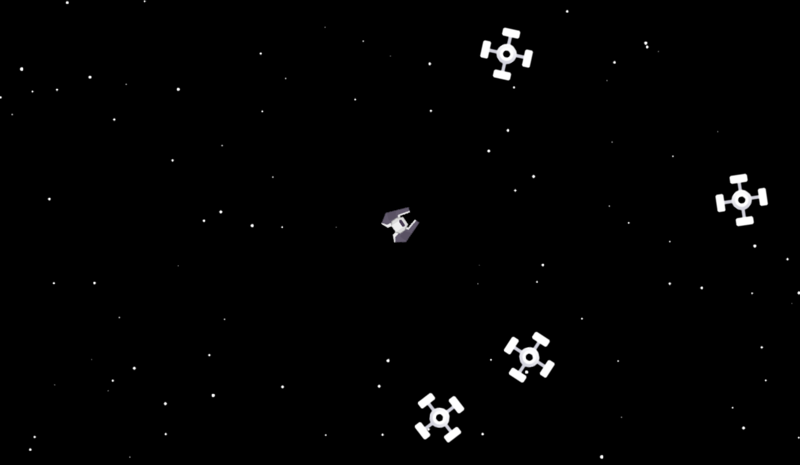
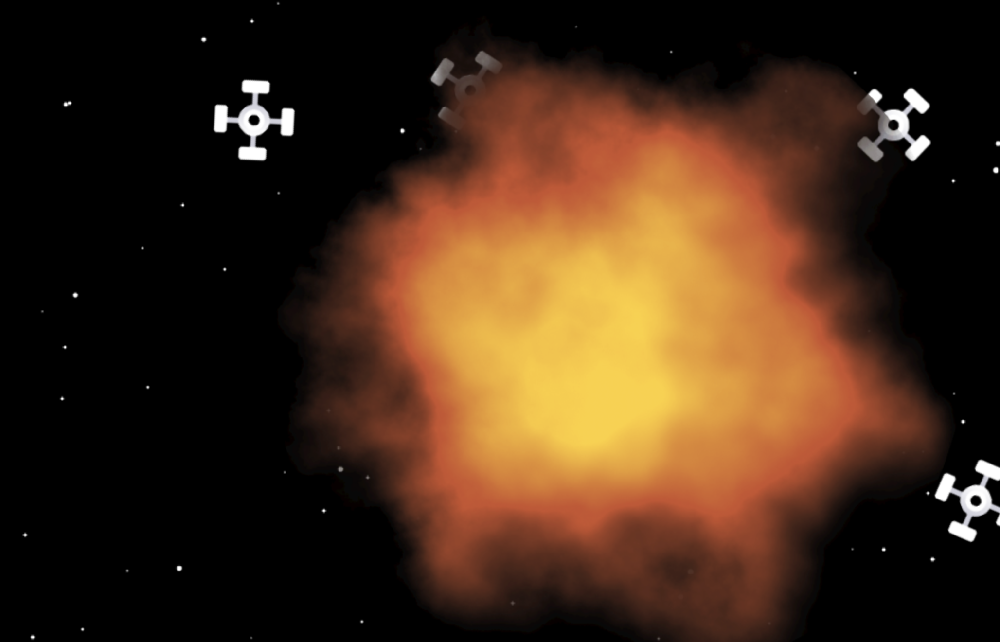

# Space-Minesweeper   
The purpose of this game is about learning to use `Vector` in 2D graphics.

## Recommendation
To ensure this graphic work smoothly, use `Google Chrome` or `Microsoft Edge`

## Link to Github Page

Use this link to play the game: https://chorkhieng.github.io/Space-Minesweeper/

## Sample Scene  

Ship and mines in the sky  

Explosion in the sky when the ship collides with mine(s)

